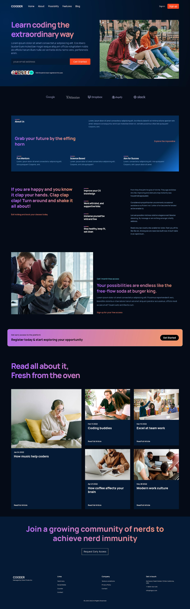

## DESCRIPTION:
- A Responsive website made with React.
- [Youtube Video of the App](https://youtu.be/2Ao0ZuziuQg)

## OUTCOME:
- Using React + vanilla CSS to make a modern responsive website.
- link to the App's video on youtube: https://youtu.be/2Ao0ZuziuQg

## TECH STACKS:
- React,
- react-icons,
- Hooks: useState.
- styling: CSS with BEM naming convention.

## PROGRESS:
- Done: 100%

## How to run
`yarn install`
`yarn start`

## View other projects:
- [My Blog](https://hashnode.com/@marizoo)
- [My Pinterest](https://pin.it/16vGwjy)
- [My Youtube Channel](https://www.youtube.com/channel/UCfkbnM9WvHD3mjecBiGHCBQ/playlists)

## IMAGE:

